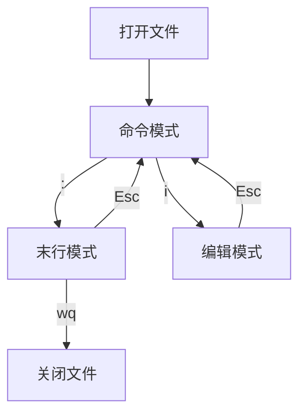

使用Linux必备的编辑器和软件安装工具conda

<!--more-->

## Vim 文本编辑器

三种模式

Ctrl+r  取消撤销

### 命令模式

命令模式是使用vim打开文件时的默认模式，无论在哪种模式下，按下Esc键就会进入正常模式。在这个模式下，可以移动光标，删除某个字符，删除某行，复制多行，粘贴多行。

| 操作             | 命令                                                         |
| ---------------- | ------------------------------------------------------------ |
| 移动光标         | 方向键或者hjkl ^和$：快速到所在行的开头和末尾（用0也可以到开头） </p>  30j：向下移动30行（数字+方向进行快速移动）</p> ctrl+f或b:上下翻页（forward/back）</p>gg：快速回到文档的第一行的第一个字符</p>G:快速到文件底部 |
| 剪切、复制与粘贴 | x：剪切一个字符  </p> 10x：连续剪切10个字符（numberx）  </p> dd：剪切所在行 </p> 10dd：剪切所在行及向下共10行 </p> yy：复制光标所在行 </p> 10yy：复制所在行及下面10行 </p> p或P：在当前行的下面/上面进行粘贴 |
| 撤销动作         | u：撤销 </p> ctrl+r：取消撤销                                |

### 编辑模式

在命令模式下按下i键，进入编辑，插入模式里可以进行文字的输入，在该模式下按Esc键切换到普通模式。

### 末行模式

在正常模式下输入“:”或“/”进入命令行模式，在该模式下可以进行设置、查询、替换、保存并退出等。

## Conda

###  Conda是什么？

- conda是所有语言的包、依赖和环境管理器。
- 适用平台: Windows, macOS and Linux.
- 一般建议安装**miniconda**就可以了

### Conda的下载

① 如果服务器在国内就搜索conda 北外，使用镜像下载；如果服务器在国外搜错conda选择官网。进入后找到miniconda3-latest，右键复制链接地址
② 使用wget -c下载。例如在Linux输入命令

```ssh
#查看linux版本
cat /proc/version
#下载
wget -c https://mirrors.bfsu.edu.cn/anaconda/miniconda/Miniconda3-latest-Linux-x86_64.sh 
#`-c`参数可以实现文件下载的断点续传。
```

③ 运行安装脚本

```ssh
#安装
bash Miniconda3-latest-Linux-x86_64.sh
#注意bash后要替换成自己下载的安装包的名称
```

④ 同意license
按`q`键退出，输入yes同意
⑤ 选择安装位置
**安装在默认位置**：直接回车
**自定义安装位置**：在下方输入
**输错了怎么删**：ctrl+Backspace
⑥ 同意conda初始化
⑦ 重新加载.bashrc文件

```
source ~/.bashrc
#能够用conda -h输出conda的帮助文档就说明安装成功啦
```

⑧ 设置默认激活base

```
conda config --set auto_activate_base false
#设置与否基本没有差别 根据个人喜好设置即可
```

### 1.3 Conda的使用

### 配置频道

使用`conda config --add channels <URL>`添加频道

后添加的频道优先级会更高，重复添加可以提升频道优先级

`conda config --show channels` 查看已添加频道

北外镜像频道： **（镜像经常变化，大家最好自己找找）**

```conda config --add channels https://mirrors.bfsu.edu.cn/anaconda/pkgs/free/
conda config --add channelshttps://mirrors.bfsu.edu.cn/anaconda/pkgs/main/
conda config --add channels https://mirrors.bfsu.edu.cn/anaconda/cloud/conda-forge/
conda config --add channels https://mirrors.bfsu.edu.cn/anaconda/cloud/bioconda/
conda config --set show_channel_urls yes 
```

### 管理小环境

```
创建环境：conda create -n rna #-n指定环境名称
删除环境：conda remove -n rna -a
启动环境：conda activate rna
退出环境：conda deactivate
列出已存在的小环境：conda env list

##重命名小环境
conda create -n Python2 
conda create -n py2 --clone Python2
conda remove -n Python2 --all
```

### 安装软件

安装使用`conda install <SOFTWARE>`注意，安装前要先打开想要安装到的小环境
升级使用`conda update <SOFTWARE>`
删除使用`conda remove <SOFTWARE>`
**示例**

```
conda install fastqc
conda install -y miltiqc fastp #安装多个，-y参数可以跳过询问环节
conda remove -n rna fastqc #指定-n参数可以不进入环境进行删除
```

**注意**

下载软件之前，先在官网上搜一下名字是否正确，也可以搜到安装方法：https://anaconda.org/main/repo

### 1.4 mamba

改进conda安装软件存在的一些速度慢、处理环境失败等问题
### 安装
```
#切换到base环境（确保安装在base）
conda activate base
#在base环境下安装mamba
conda install mamba
```
### 使用
除启动环境外（conda activate rna），所有conda的命令都可以用mamba来代替